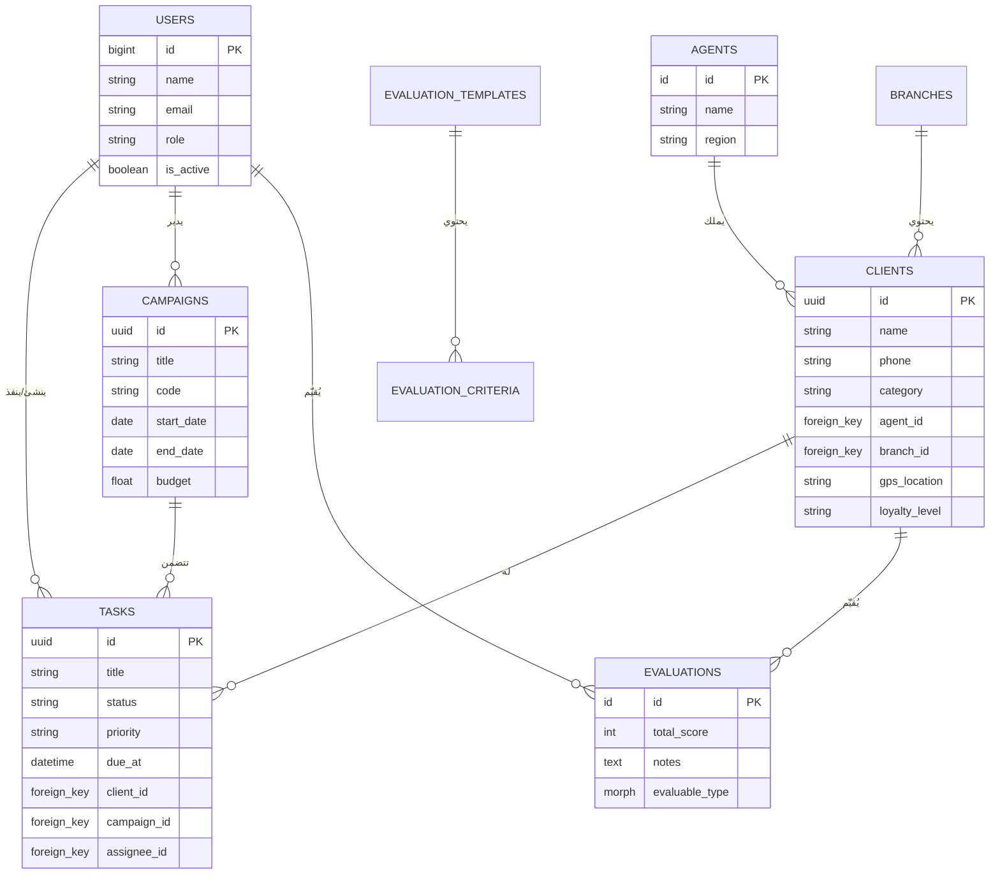
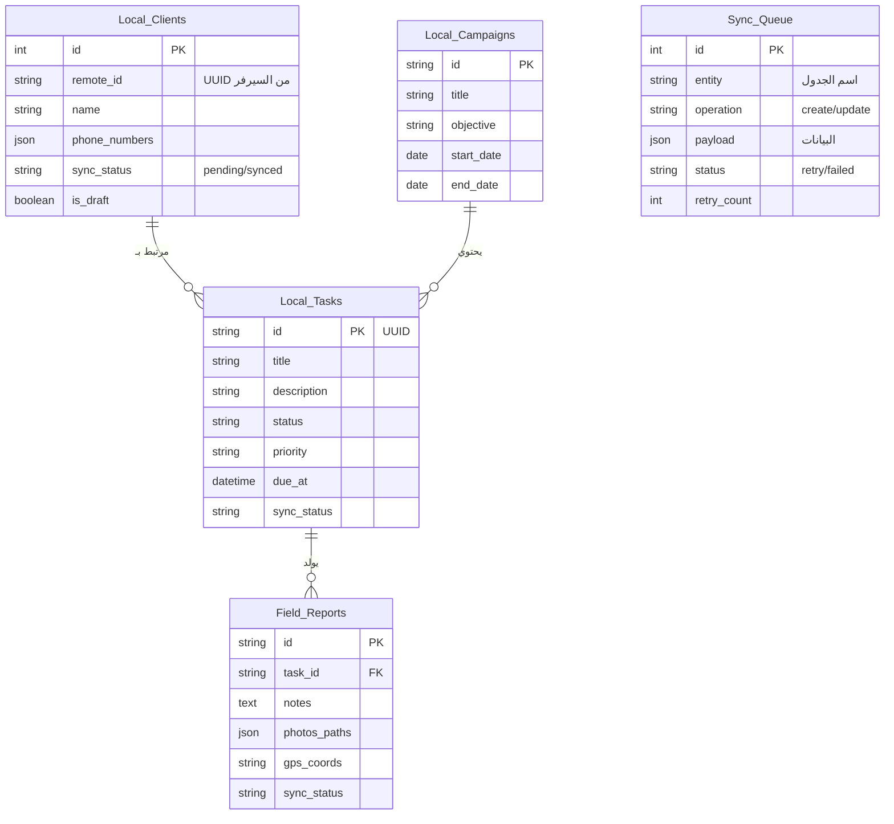
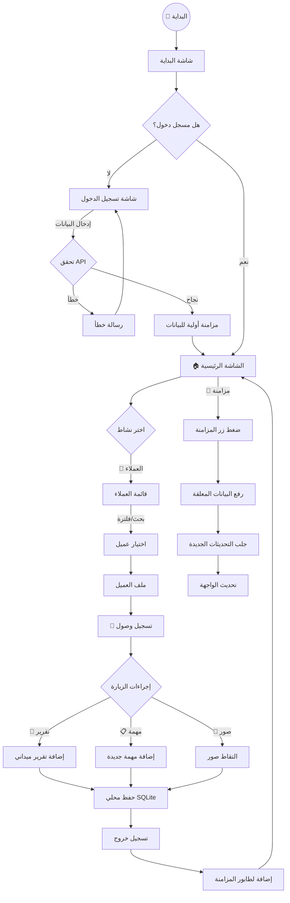
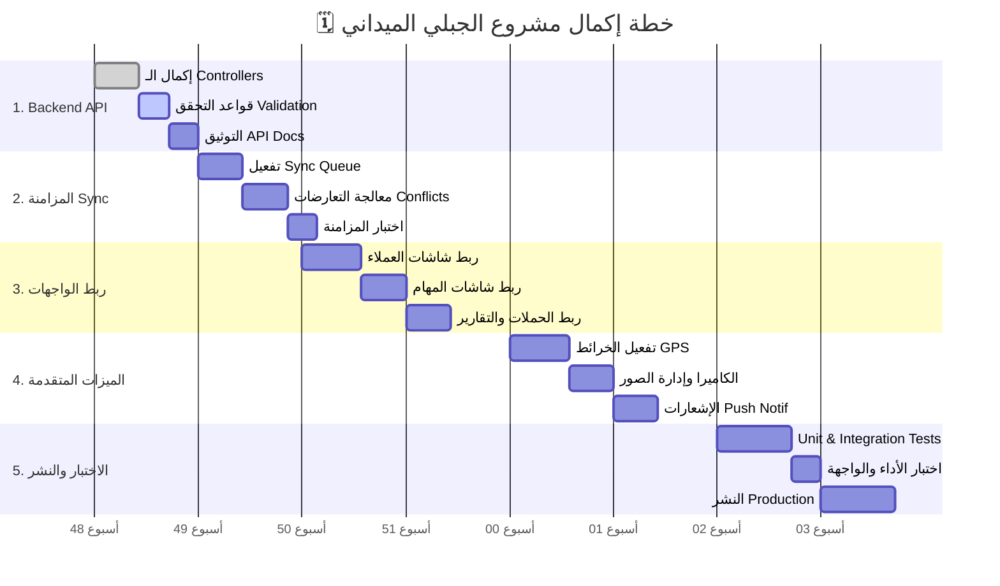

# 📊 مخططات نظام الجبلي الميداني

يحتوي هذا الملف على المخططات الشاملة للنظام (Frontend & Backend) باستخدام لغة Mermaid JS، والتي توضح الهيكلية، قواعد البيانات، سير العمل، والخطة الزمنية.

## 1. المخطط الهيكلي للنظام (System Architecture)

يوضح هذا المخطط المكونات الرئيسية للنظام والعلاقات بينها: تطبيق الهاتف للمسوقين، ولوحة التحكم للإدارة، والخوادم وقواعد البيانات.

```mermaid
graph TD
    %% المستخدمون
    UserMobile[👤 المسوق الميداني] -->|يستخدم| MobileApp[📱 تطبيق Flutter]
    UserManager[👤 المدير/المشرف] -->|يستخدم| AdminPanel[💻 لوحة تحكم Filament]

    %% تطبيق الموبايل
    subgraph "Mobile Client (Frontend)"
        direction TB
        MobileApp -->|يقرأ/يكتب| LocalDB[(🗄️ Drift / SQLite)]
        MobileApp -->|يخزن ملفات| LocalStorage[📂 Secure Storage]
        MobileApp -->|يدير| SyncWorker[🔄 Sync Service / Queue]
    end

    %% السيرفر
    subgraph "Backend Server (Laravel)"
        direction TB
        AdminPanel -->|HTTPS| Laravel[⚙️ Laravel Core]
        SyncWorker -->|API / JSON| API[🔌 API Routes]
        API -->|مصادقة| Sanctum[🔐 Laravel Sanctum]
        API -->|يعالج| Controllers[🎮 Controllers]
        Controllers -->|يخزن| ServerDB[(🗄️ MySQL Database)]
        Laravel -->|يدير| Shield[🛡️ Filament Shield (Roles)]
    end

    %% التنسيق
    style MobileApp fill:#e3f2fd,stroke:#1565c0,stroke-width:2px
    style AdminPanel fill:#fff3e0,stroke:#e65100,stroke-width:2px
    style ServerDB fill:#e8f5e9,stroke:#2e7d32,stroke-width:2px
    style LocalDB fill:#e8f5e9,stroke:#2e7d32,stroke-width:2px
    style API fill:#f3e5f5,stroke:#7b1fa2,stroke-width:2px
```

---

## 2. مخطط قاعدة البيانات الخلفية (Backend ER Diagram)

يوضح العلاقات بين الجداول الرئيسية في قاعدة بيانات السيرفر (MySQL).



---

## 3. مخطط قاعدة البيانات المحلية (Frontend ER Diagram)

يوضح جداول قاعدة البيانات المحلية (Drift/SQLite) وكيفية تخزين البيانات أوفلاين.



---

## 4. مخطط رحلة المستخدم (User Flow)

يوضح الخطوات التي يقوم بها المسوق الميداني منذ فتح التطبيق وحتى إتمام المهام.



---

## 5. الخطة الزمنية للمشروع (Project Roadmap)

مخطط جانت (Gantt Chart) يوضح الجدول الزمني المقترح (8 أسابيع) لإكمال المشروع بناءً على التحليل الحالي.


